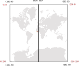

Data structure
===============
The input data are in CSV format with comma separator. The example you can see in upcoming code

```txt
x,y,accident_index,timestamp,accident_severity,road_type,speed_limit,light_conditions
126.69700124,83.93900464,200520D002602,1104610980,2,6,30,4
126.68708053,84.01963555,200520D002703,1104691500,3,6,30,1
126.72420338,84.0324244,200520D004203,1104771840,3,3,40,1
126.67025493,84.00469991,200520D004603,1104937500,1,6,30,1
126.67913244,84.01584193,200520D006503,1104962400,3,3,30,4
126.65424924,83.92462789,200520D007402,1104851700,3,6,30,1
126.71369387,83.89046812,200520D007702,1104834900,3,6,30,1
```

There is two required column:

* x coordinates
* y coordinates

X and Y coordinates
-------------------
In following figure there is used coordinates system (red color). The coordinates represents pixels in 0 level of tile tree of EPSG:3857.


The equations are:


where  and  are coordinates for WebGLayer. The  and  coordinates are in EPSG: 3857.

You can use postgresql functions (PostGIS is required):
```psql
CREATE OR REPLACE FUNCTION public.topixels_x(the_geom geometry)
    RETURNS double precision AS
$BODY$
DECLARE
BEGIN
    return (st_x(st_transform(the_geom,900913))
    +20037508.34) / (20037508.34*2)*256;
END; $BODY$
LANGUAGE plpgsql;
```

```pasql
CREATE OR REPLACE FUNCTION public.topixels_y(the_geom geometry)
    RETURNS double precision AS
$BODY$ 
DECLARE
BEGIN
    return (-st_y(st_transform(the_geom,900913))   
    -20037508.34) / (20037508.34*2)*256 +256 ;
END; $BODY$
LANGUAGE plpgsql;
```

Timestamp
---------
Timestamp is usual property of event. Date, weekday, time or month can be separated form timestamp. The suitable format for timestamp is number of second from 1970. See to example.

Example
-------
Example SQL query for export data from table, where the data are stored.
```sql
SELECT EXTRACT(EPOCH FROM datum_udalosti) as timestamp,
 topixels_x(geometry) as x, topixels_y(geometry) as y
  FROM table;
```
The query should be executed to a file.